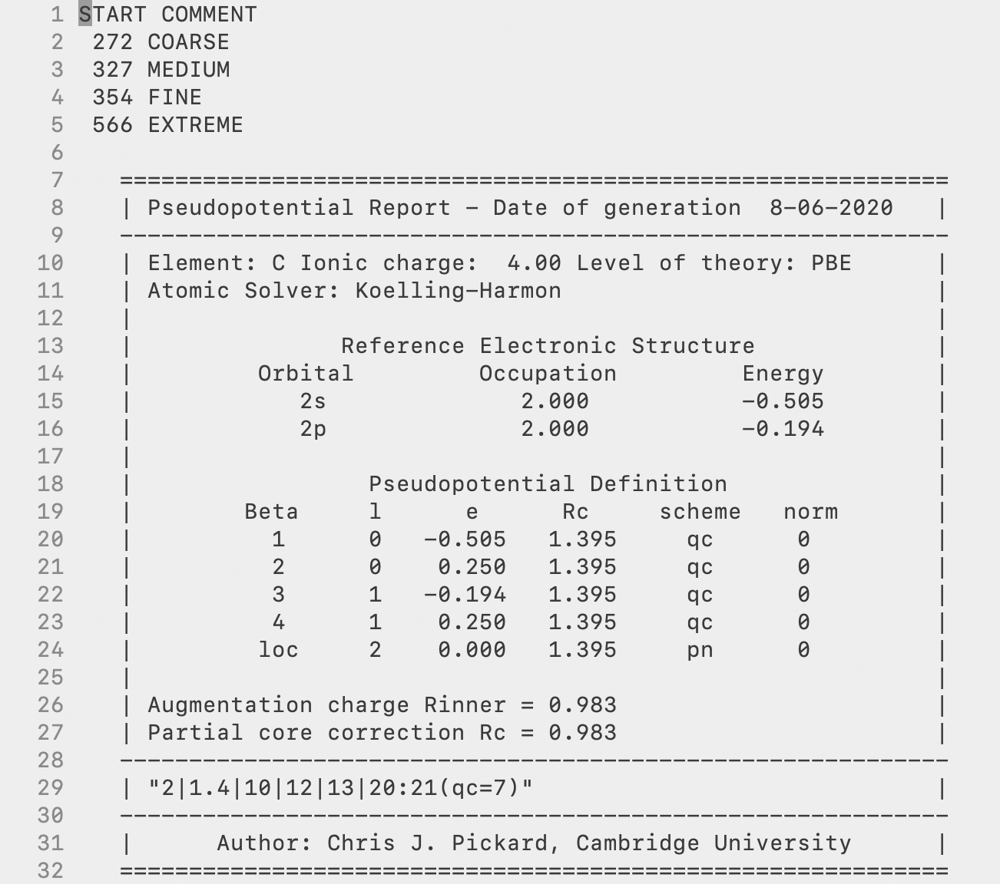
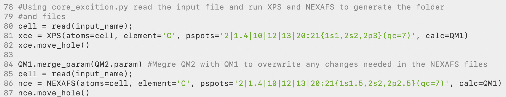
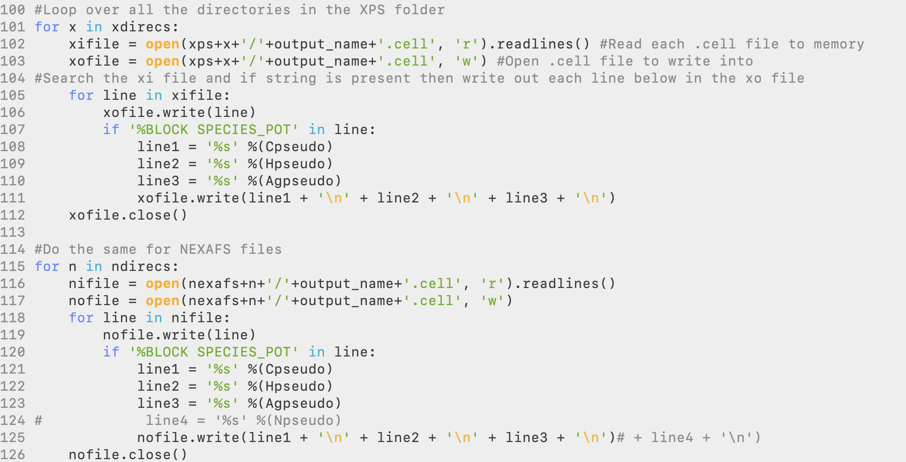
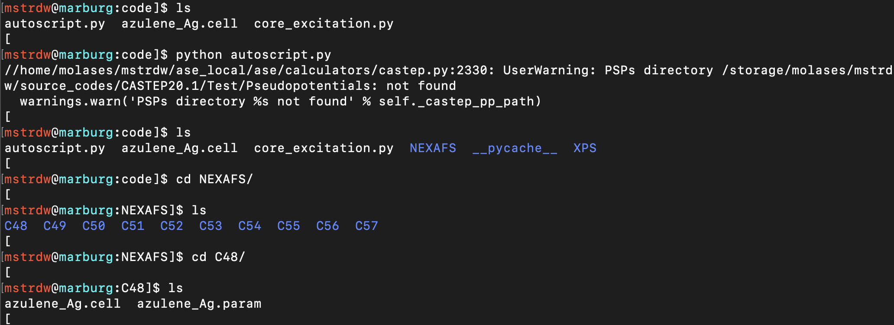
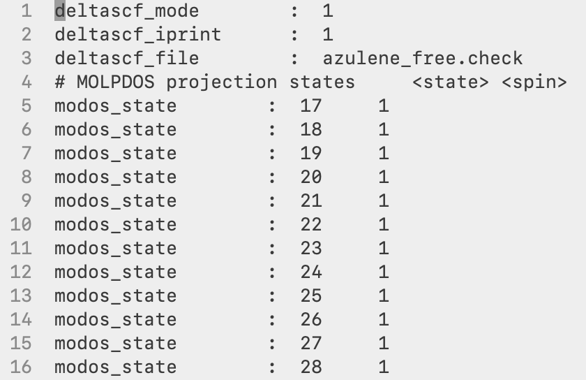
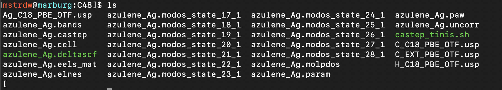
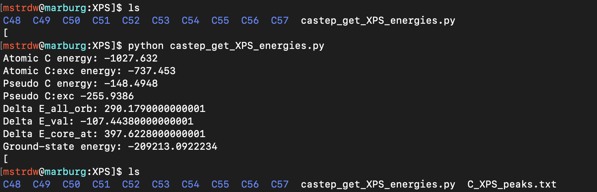
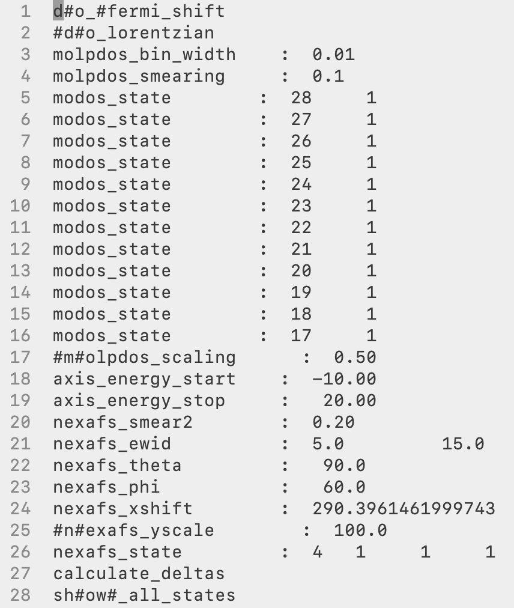
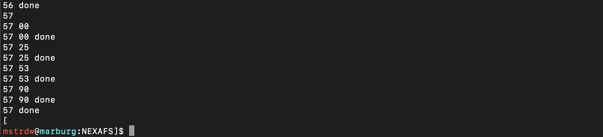
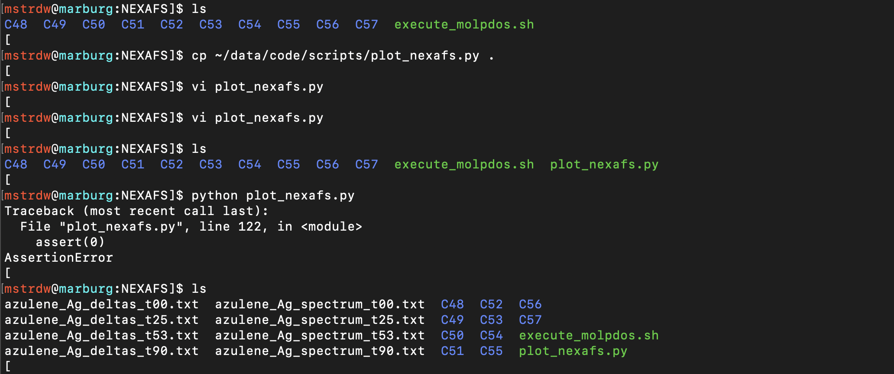

# CASTEP XPS and NEXAFS Tutorial

All tools needed to generate XPS and NEXAFS spectra can be found on the Maurer Group Github in the 'grouptools/NEXAFS_scripts' repository. Included in this are several tools to help in this process:

* _autoscript.py_ - Python script which will generate all XPS and NEXAFS input files
* _core_excitation.py_ - Code in which the autoscript will use
* _castep_get_XPS_energies.py_ - Python script to calculate the XPS binding energies
* _plot_xps.py - Python script to sum up XPS peaks and broaden into a spectrum
* _execute_molpdos.sh_ - Bash script to run MolPDOS for all angles and atoms
* _plot_nexafs.py_ - Python script to process MolPDOS output data into a broadened NEXAFS spectra
* _plot_mo.py_ - Python script to process MolPDOS output data into MO orbital spectra

## 1. Set-Up
To begin with, a suitable file system, naming convention, and some initial ground-state calculations are needed to help with the process. In CASTEP all files, input, and output have the same seedname so for our system we will use a '_molecule_metal_' configuration. This is important to implement right from the beginning as scripts used later will use this convention. The '_molecule_' is simply just the investigated molecule, e.g. azulene, benzene, pyridine, and the '_metal_' is the metal substrate, e.g. Cu, Au, or simply gas if no metal surface is present. So for example in this tutorial, we will be looking at azulene on a silver surface so files would use _azulene_Ag_ as the seedname to make files such as _azulene_Ag.cell_ and will continue with this tutorial using this system.

Next, to organise the filing system to use, once all set up this should contain:
* Input and output files from the initial ground-state calculation
* **freestand** directory (Directory containing files from the calculation of the free-standing overlayer, only needed when including a metal surface)
* **XPS** directory (Directory generated by autoscript.py)
* **NEXAFS** directory (Directory generated by autoscript.py)

and should end up looking something like this.

The initial singlepoint ground-state calculation should be the first to be completed. The reason for this can be for several reasons but the main one is to work out the ground-state total energy that will be used later to calculate the XPS binding energies. It is then important to make sure the settings you are using for this are sufficient and will be carried on through the process. If this is your first time using CASTEP or do not know the pseudopotential for an element, this step can be used to generate on-the-fly pseudopotentials and obtain the pseudopotential strings for all elements in the calculation. If you are already well versed in CASTEP and already know which pseudopotentials you will use, you can set the in from the start here and skip this.

If you're investigating a molecule on a metal surface rather than a gas-phase molecule, you will need to perform a second singlepoint calculation. This will be carried out in the **freestand** directory. In here you should copy over the _.cell_ and _.param_ files from the ground-state but rename them _azulene_free_ to describe correctly and avoid confusion and required for a later step. In this directory you will need to open up the _.cell_ file and delete the metal surface, leaving only the molecule, which is called the free-standing overlayer. This step is carried to generate the _azulene_free.check_ file which is used later on in the NEXAFS calculations for the MO projection. If your system is a gas-phase system (no metal surface) this step and be skipped as the .check file that will be used will be from the ground-state calculation previously ran so for this would be the _azulene_gas.check_ file.

To acquire the pseudopotential string if needed, open any of the _.usp_ files. Here we will use the _C_C18_PBE_OTF.usp_ file. At the top of the file should give you all the information about the pseudopotential used and near the bottom of the box will be the definition string for you to copy to use for the XPS and NEXAFS calculations. In this case for carbon, the string is `2|1.4|10|12|13|20:21(qc=7)`, record this down and do the same for each element in the system to use in the next step.

## 2. Generation of XPS and NEXAFS inputs using autoscript.py

To generate the XPS and NEXAFS directories with all the input files needed for each individual carbon atom you need to set up a directory with:
* _autoscript.py_
* _core_excitation.py_
* _Geometry file of the system_

The _core_excitation.py_ file can be left alone and doesn't need to be altered. To use this code all you need to do is open up the _autoscript.py_ file and change the required fields and set the settings you want in the calculation, overall, this will be the same as the ground-state calculations with a few exceptions which will be explained. At the top the first thing to alter is the `input_name`, the geometry file to read in and the `output_name` you want the script to use as the CASTEP seedname. In this case, these two are basically the same and would be `azulene_Ag.cell` and `azulene_Ag` but through ASE, you can read in any file format you want if needed.

Next is where you need to set the elements and pseudopotential strings you save before. Here you can create any number you need and copy in the pseudopotential strings. For the atoms you want to study the XPS for you will need to copy in the pseudopotential string twice again but this time adding in the electron configuration to include either a full core-hole (XPS) or half core-hole (NEXAFS). This is done starting at line 81, where for a C1s calculation we put in `element='C'` and `pspots='2|1.4|10|12|13|20:21{1s1,2s2,2p3}(qc=7)'` with the full core-hole in the `xce` and the same again for `nce` but this time with a half core hole.

Also, starting on line 100 is where the pseudopotential strings you stated at the top are written out to the .cell files and you need to add/change to match with the elements you have, this will include adding in any new lines for the number of elements and adding this line to the print line for both XPS and NEXAFS sections. In the default script included is an example of how a new line if a 4th element nitrogen is needed and if a gas-phase calculation is begin run then the metal and line3 would need to be commented out.

The final part is to set the parameters you want for the calculation. Under the CASTEP calculators `QM1` and `QM2` you should set `castep_command` to the path of where your CASTEP binary is located. Next in QM1 choose and set all the keywords you want to include in the XPS calculation. Then if any settings need to be changed for the NEXAFS calculation add these to `QM2`. Most likely this will only need to be `nextra_bands` and `elnes_nextra_bands`. This is due to only the first needed for XPS and usually, only a low number is needed and any higher is a waste computationally. For the NEXAFS calculations the second term is needed and to generate a nice full spectrum without it ending too soon a much larger number of bands are needed and for the MolPDOS analysis, both `nextra_bands` and `elnes_nextra_bands` need to be the same value in the NEXAFS case. So set this value to a higher value(trial and error/learning will help with picking a suitable number).

To get a general idea of what are suitable settings you will need to change and use, `cut_off_energy=450` is suitable enough for most systems, a sanity check to make sure you have a suitable value is to look at the _.usp_ files for all elements and at the top of the file are cut-off values and a level of accuracy they give, make sure all elements are at least FINE, `kpoints_mp_grid='6 6 1'` is sufficient for metal surface structures and only `'1 1 1'` is needed for gas-phase. For XPS calculations `nextra_bands=100` is more than enough. For `elnes_nextra_bands` this depends on the metal used and for gas-phase as well the size of the unit cell. The larger the unit cell the higher number needed along with higher atomic number metals, a good starting point would probably be `1000`.

Finally, if a MolPDOS analysis is needed you need to set a few other keywords for this. The first is the molecular orbitals you want to project out. Here you can give as many MO states as you want but the key ones you want are the frontier states around the HOMO and LUMO. To get the correct numbers of the HOMO and LUMO you can simply sum up all the electrons in the valence shell of all atoms in the molecule and divide by two. For hydrogen this is 1, carbon is 4, nitrogen 5 etc. The halved number will correspond to the HOME state. So in this case for azulene, C10H8 has a total of 48 valence electrons, so state 24 is the HOMO. You would ideally like a range above and below the bandgap with more unoccupied states than occupied. In the script change the range in MO to the required range and secondly is the reference .check file needed. This will be the azulene_free.check so change this to the right name. For a gas-phase calculation, I would suggest something along the lines of azulene_ground.check as keeping the same name as it is already would not work. Last is to comment out the `assert 0` on line 130 to run the part of the script that will write these settings out.

Once all of that is done it is time to run _autoscript.py_, you should see two directories called XPS and NEXAFS have been created. These should contain a directory for each carbon atom in your molecule labeled with a number, this number just corresponds to the order it appears in the input geometry file. If you look into these directories they should contain the two CASTEP input files _.cell_ and _.param_. You can easily copy the parameter file over to the main folder, set the charge to zero and use it for the ground state calculation.

You will notice that running _autoscript.py_ will give a warning that a pseudopotential path has not been given to the calculator, this is fine and is not a problem as we are specifically stating our pseudopotentials out and not using a database which is what the code is asking for. This function can be used to point to a database of pseudopotentials which is not implemented to keep full control over the pseudopotentials we want to use.

## 3. Setting up and running jobs
Now you can copy over the contents of your newly created **XPS** and **NEXAFS** folders back to your main folder and finally set a few things left before copying over the files to your chosen cluster to run them.

The first would be to create your reference _azulene_free.check_ file needed for the MolPDOS calculation. Once this is done this file then needs to be copied into every atom directory in the NEXAFS directory. If a gas-phase calculation is being performed this will instead be the _azulene_gas.check_ created from the ground state calculation and changed to be called _azulene_ground.check_. Also, what is needed is a .deltascf file which gives the parameters needed for the MolPDOS calculation, here we point the code to the _azulene_free.check_ file and list the specific states that we want to project out.

Once done each atom folder should look like this.

All that's is left is to run all of the XPS and NEXAFS jobs. In regards to the number of nodes and walltime needed for the calculations, the XPS calculations will be similar to the length of the ground-state calculation. The NEXAFS will require more memory (nodes) and longer walltimes and the best practice would be to run only one calculation first to gauge this and then use the settings for all of the rest. With time a better understanding of the requirements needed will be able to be learned. Once done transfer the data back to your local machine and for NEXAFS calculations you should see the usual outputs along with a _.molpdos_state_x_1_ file for all MO state you gave earlier.

## 4. Obtaining and plotting XPS

The first task that needs to be done after all the calculations are done is to calculate the XPS binding energies for each atom and plot the spectrum, to do this we will use the two scripts:
* _castep_get_xps_energies.py_ 
* _plot_xps.py_

The _castep_get_xps_energies.py_ python script should be placed in the **XPS** directory and then the necessary parameters have to be changed in the script manually. These will be the `filename`, `element` and `atoms` to the required settings that match the system. Once this is done, the script can be executed and it will read the groud-state and excited-state energies for each atom and calculate and apply the pseudopotential correction, and finally print out the binding energies into an XPS_peaks.txt file.

With the XPS binding energies now written out, the _plot_xps.py_ script can be used to take the individual shifts and sum them all up and plot them into a broadened spectrum. By commenting out the `assert 0` command on line 87 the script will broaden each individual atom peak and create text files for each atom which can be plotted along with the full spectrum to show the breakdown of the spectrum.

## 5. NEXAFS Post-Processing and MolPDOS

Now to run the NEXAFS post-processing we need a settings file with all the information needed, this will be a _.molpdos file_. In this file, you will see a variety of settings needed to calculate the NEXAFS and MO data. The most significant ones that need to be changed are:
* `nexafs_theta` - The theoretical X-ray incidence angle you want to calculate for
* `nexafs_xshift` - The XPS binding energy corresponding to the same carbon, will be done automatically by the script
* `nexafs_state` - Which atomic species you want to calculate for, you will need to only change the first number. This number will be +1 the number of elements in the system, as for this example, is `4 1 1 1`. 4 because the first element is hydrogen, second is carbon, third is silver and the last is the new excited carbon, `C:exc`, we defined (this element will always be the last one in the list).

If you want to project the NEXAFS transitions onto molecular states of a reference system, you also have to set:
* `modos_state` - Set the corresponding states to exactly the same orbital values you selected previously for the calculation

To run the MolPDOS post-processing you first need to have the MolPDOS binary located in your path and this will use the _execute_molpdos.sh_ script to first add the correct nexafs_xshift to the right atoms and then run the MolPDOS binary for each angle you want. So these need to be set at the top of the script, change the first `Array` to the correct values of the atoms and the AngleArray to the incidence angles you want to calculate. The change the molecule, metal and element to the correct setting and then run the script.

This script will take some time to run and finish for all of the atoms and angles but will write out the progress of the script into the terminal to show you the progress. To not take up the terminal nohup can be used to run the script in the background. Once done this will have to generate a new folder in each of the atoms folders for each angle chosen and be filled with a whole host of _.dat_ files.

These should be organised into a corresponding directory labeled based on the theta value, for example, **t25**. Repeat this MolPDOS process for each incidence angles you want to simulate for and for all carbon atoms. Normal practice would be for 00, 25, 53, and 90 degrees. Your directory for all carbons should look like this.

You should use an automated script for this procedure. Provided is the _auto_molpdos.sh_ script which should be executed in the NEXAFS directory, It reads the _C_XPS_peaks.txt_ file (copy from XPS to the NEXAFS directory), changes a generic _.molpdos_ file to match the desired angle and XPS binding energies, goes to the corresponding carbon directory, and executes the script, and moves the resulting data in the respective folders.

## 6. Summation and broadening of the NEXAFS spectra

The final step left to do is to take all of the data produced through the MolPDOS post-processing, sum the contributions from all carbon atoms and applying a broadening function to create the NEXAFS spectra. For this you will need the python scripts:
* _plot_nexafs.py_
* _plot_mo.py_

These scripts should be placed in the **NEXAFS** directory and change the corresponding settings inside the script to match you data. These are listed into different groups, the first is `Broadening Parameters`. These are the settings of the pseudo-Voight broadening scheme that will be applied, the settings in there are the default carbon settings that usually work best but they can be modified to create the best spectra. If a different element is being studied N or O K-edge then the `xstart` and `xstop` values will have to be changed to fall in the energy range of the chose element. The next group are the `System Settings`, these are the main settings to change. Here we have the `molecule` and `metal` variables to change to the name of your system, and then also the `element`. We have the `n_type` which will decide what NEXAFS spectra you want to generate, a number between 1-4, default would be 4, the script shows what each number performs. `angle` you will set to the same angles you selected when running MolPDOS, so in this case `'t00', 't25', 't53', t90'`. Then the `numbers` will be the number range of your atom directories, here 48 to 57, and the atom number, this is as described before the value the excited element comes in the list of all elements, always the last number.

Run this script and it will generate (for each angle) a _*deltas.txt_, containing the summed up raw data of all NEXAFS transitions, and a _*spectrum.txt' file with the fully calculated broadened spectrum. If the individual carbon contributions of the NEXAFS spectrum is desired then comment out the `assert 0` command on line 122 and this will generate a separate _.txt_ file for each individual atom at each angle.

The last step would be to output the individual MO contributions, these settings to change are the exact same as before for the NEXAFS script but now with one more which is `MO`, which will be the list of MO orbitals you choose to project out. Run the script again and you will receive a _*.txt_ file of the delta peaks and the broadened orbital projection for all orbitals and angles. This can now be plotted with its corresponding NEXAFS spectra to view its contributions.

